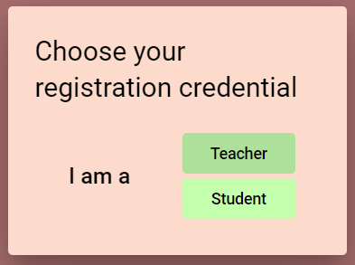
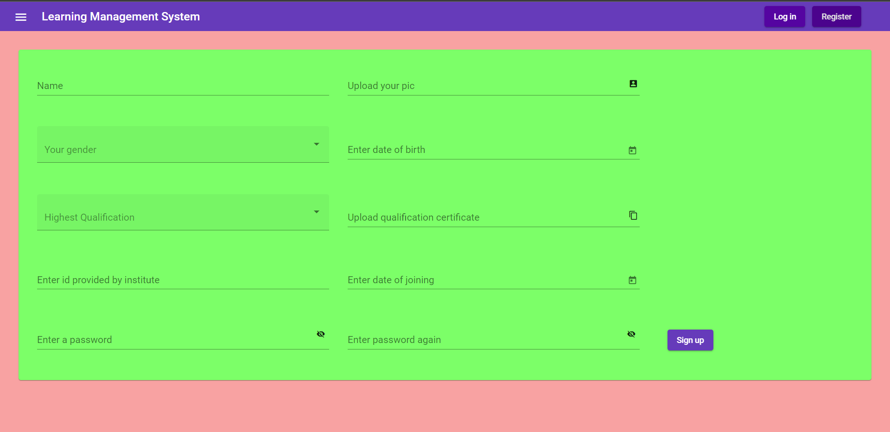
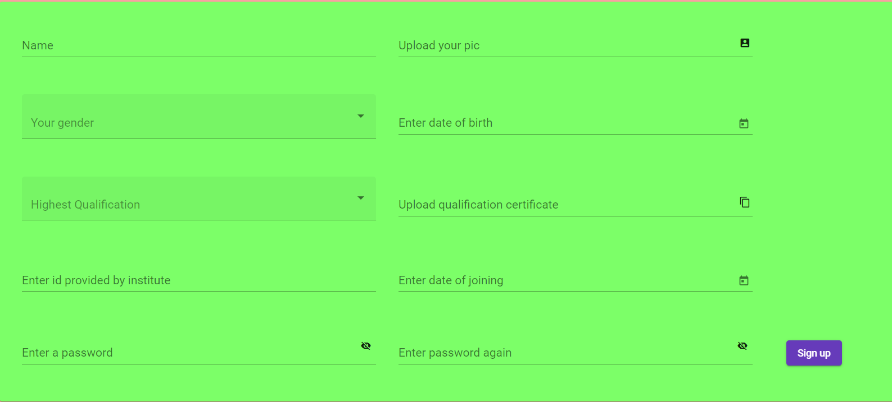
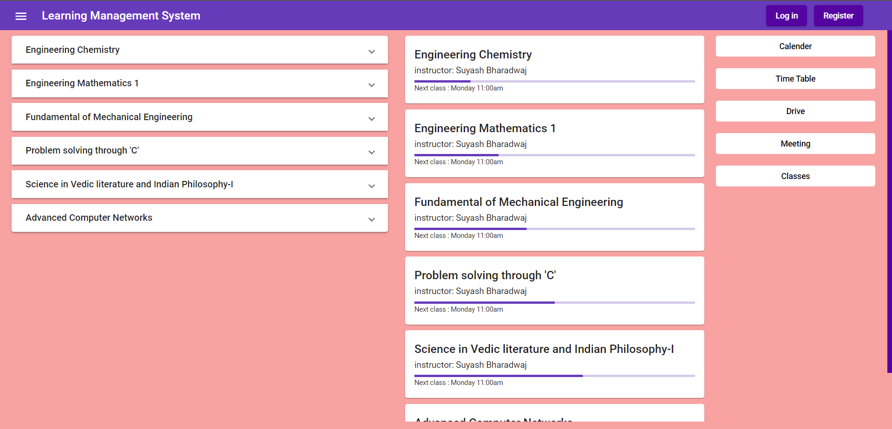
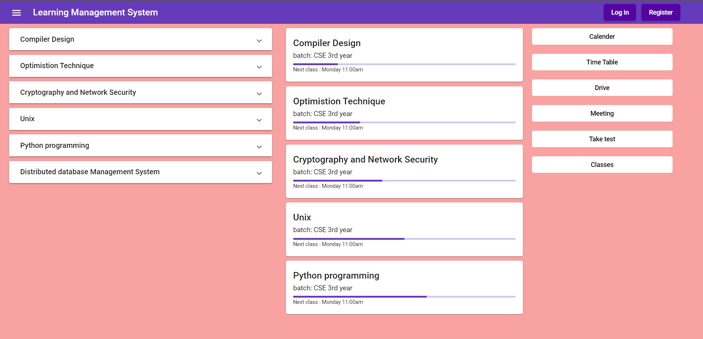
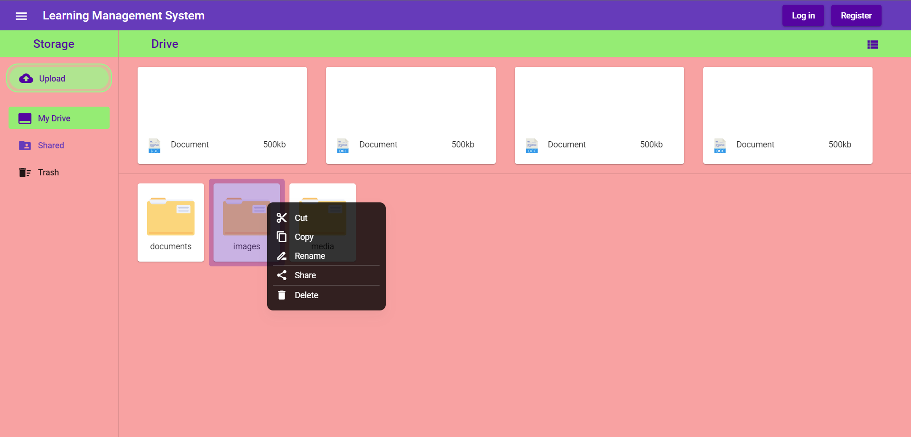
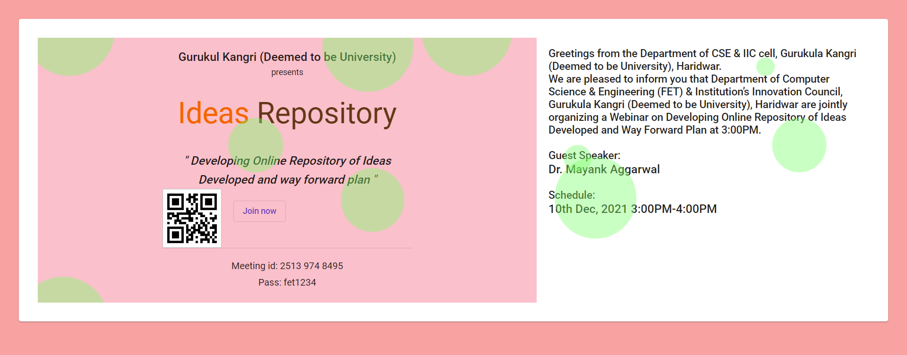

# Learning Management System

## Introduction

A learning management system (LMS) is a software application for the administration, documentation, tracking, reporting, automation and delivery of educational courses, training programs, or learning and development programs. The learning management system concept emerged directly from e-Learning. Although the first LMS appeared in 1924 in the higher education sector, the majority of the LMSs today focus on the corporate market. Learning management systems make up the largest segment of the learning system market. The first introduction of the LMS was in the late 1990s.

Learning management systems were designed to identify training and learning gaps, utilizing analytical data and reporting. LMSs are focused on online learning delivery but support a range of uses, acting as a platform for online content, including courses, both asynchronous based and synchronous based. In the higher education space, an LMS may offer classroom management for instructor-led training or a flipped classroom. Modern LMSs include intelligent algorithms to make automated recommendations for courses based on a user's skill profile as well as extract metadata from learning materials in order to make such recommendations even more accurate.

MEAN stack is one of the most popular technologies for stack development. It is used to develop a Full Stack Web Application. Although it is a Stack of different technologies, all of these are based on JavaScript language.

MEAN Stands for:

* M – MongoDB
* E – Express
* A – Angular
* N – Node.js

## Need of the project

In today’s fast-paced work environment, organizations and companies need to keep their team up students to speed with the latest trends and methods for each industry. How can you train your team effectively, and at a low cost is possible with an LMS .

1. LMSs make administration easy
Administrative tasks are a breeze with LMSs. Modern learning management systems aim for the most user-friendly interfaces possible to simplify user processes and functions. Developers understand that administrators may not be as tech-oriented and design the programs to be so easy to use that no IT experience or knowledge is required. Administrators have every tool available to simplify their work processes; they can add and remove courses or materials, import and export files, control user options, and thousands of other configurable options available only via the LMS platform.

2. Software that facilitates learning
Learners, especially those of the tech-oriented generation, appreciate a central location where training, courses, and resources are held. They especially like deviating from the traditional classroom learning and are opting for online-based courses instead.
Doing so LMSs provide intuitive and interactive learning environments that engage the student to learn in a fun but structured way. Software for learning provides far greater resources and tools than a traditional classroom would, making learning diverse for students and facilitates the development of skills via the LMS.

3. LMSs provide consistent learning resources
Since traditional classroom learning depends heavily on the instructor, students may receive inconsistent information, resources, and materials from different sources and that can hinder the learning process. With LMSs, all learning materials are standardized for all users of the course independent of their location or the time they are accessing the course. Online courses via LMSs are usually naturally intuitive and self-guided to shift the learning development responsibility from the instructors to the learners. Inconsistent learning resources also make it very difficult to measure and evaluate how the materials provided by the teacher have impacted student’s success in the course; but with learning management systems, tracking and reporting for courses is automatic and in real time.

## Project Structures

This project aims at the development of a management system for educational institutes and also for conducting classes. The important subjects/objects of institute student/teacher are the main object on which the project is built.
The project consists of various components which will be developed on a continuous improvement based model.

The various components are:

1. Architecture: The architecture consists of Faculty hierarchies and objects that need to be developed. The main components of the hierarchy are Faculty and students.

    Faculty hierarchy

	```[]
    ⟶ Faculty (or Principle)
	  |⟶ can create or modify class schedule
      |⟶ manage can view all work of Faculty underneath
      |⟶ has a complete directory
      |⟶ manage work for each branch
      |⟶ has access to time table
      |⟶ has access to ongoing class and meeting
      |⟶ responsible for conducting classes and assignment
    ```

    ```[]
	⟶ Students
	  |⟶ can create or modify self schedule
      |⟶ has a complete directory
      |⟶ has access to time table
      |⟶ has access to ongoing class and meeting
      |⟶ responsible for taking classes and assignment
    ```

2. Objects Properties

* Subjects:

  ```[]
    Name: branch + sem + subject_code
    Code: Id _unique id
  ```

* Faculty:

  ```[]
    Identity
    Assessment module
      * Marking scheme
      * Correction strategies
      * Question paper module
    Directory: Databases
      * Question paper
      * Notes
      * Evaluation strategies etc
    Communication model
      * Similar to Mailing items
  ```

* Student:

  ```[]
    Identity
    Directory: Databases
      * Question paper
      * Notes
      * Evaluation strategies etc
    Communication model
      * Similar to mailing items
    Practice module
      * Previous year papers
      * MCQ DB
  ```

  ```[]
    Class:
      * For preor models we will use static links
      * Every batch is assigned a class
      * Teachers are directed through their schedule links
  ```

Web-page view: The creation of a web-page consists of creation of views for each page and use of components and interfaces for concise and durable code/development model.The base image is generated using angular create command ng new LMS
The components and modules follow the architecture already stated.

Version-control: The project is developed under git version control and has two long-running branches: main branch for releases and development branch for further development.

### Screen-shot of Web Pages

* Registration Page:


* Faculty:


* Student:


* Login:


* Home Page:
  * Faculty:
    
  * Student:
    

* Storage Drive:


* Events:

